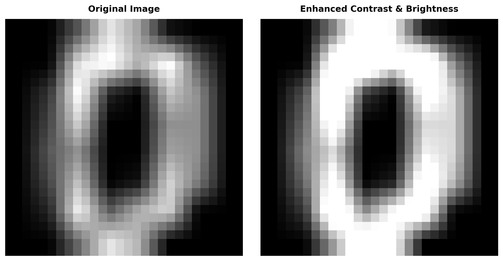
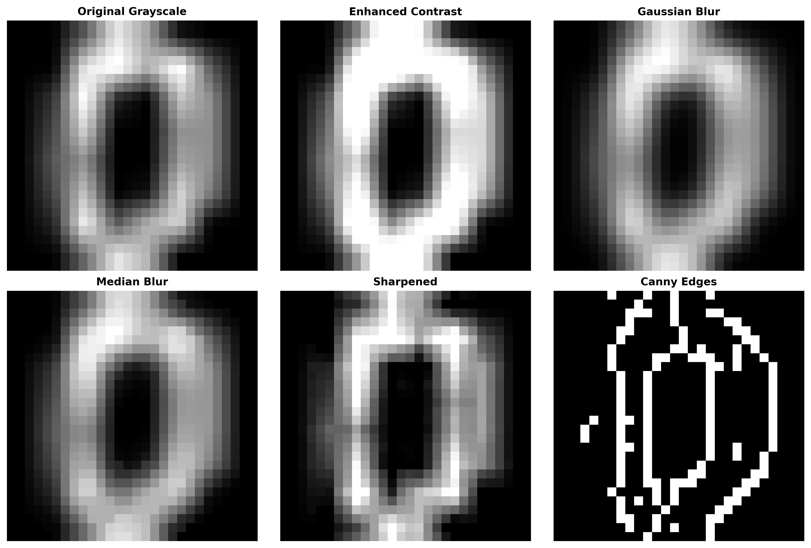
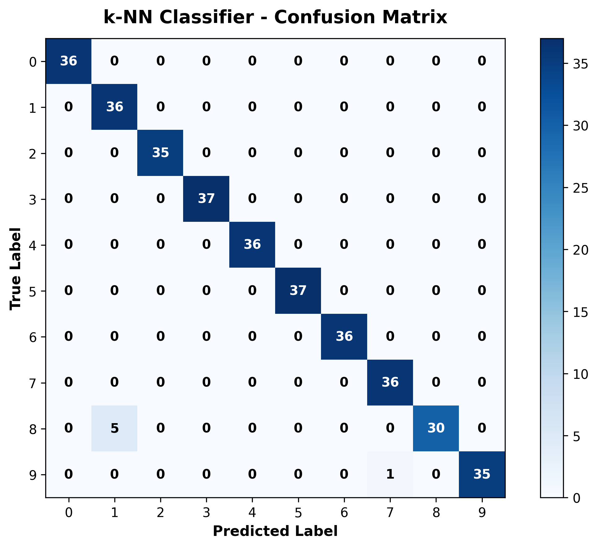
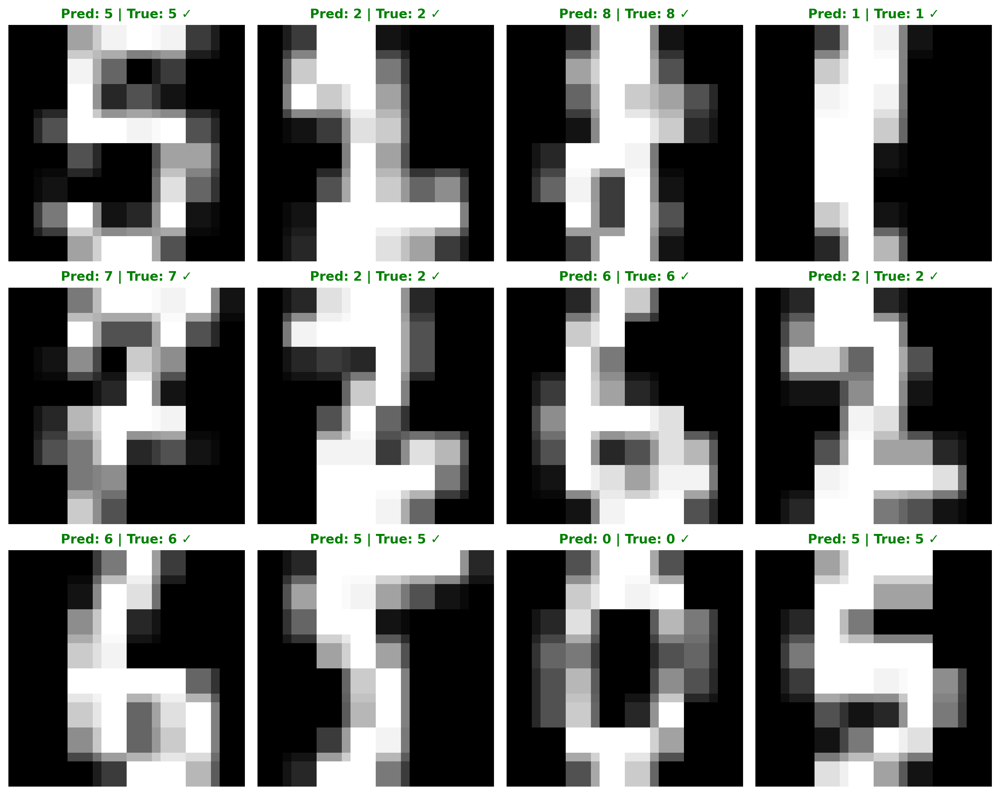

# 📷 Simple Image Classification & Image Processing with OpenCV

[](https://www.python.org/)
[](https://opencv.org/)
[](https://scikit-learn.org/)

> **CV in Practice: Task 1 (Task 18)** — Building a simple image classification system leveraging **OpenCV** for computer vision image preprocessing & enhancement, paired with **Support Vector Machine (SVM)** and **k-Nearest Neighbors (k-NN)** machine learning algorithms for digit classification.

---

## 🎯 Objective

1. **OpenCV Image Processing & Manipulation**: Apply foundational computer vision techniques including grayscale conversion, resizing, pixel value normalization, contrast & brightness adjustments, and spatial filtering (Gaussian blur, Median blur, Sharpening, Canny edge detection).
2. **Side-by-Side Visual Comparison**: Render clear comparative visual panels comparing original vs preprocessed and filtered images using OpenCV.
3. **Machine Learning Model Development**: Train and compare **Support Vector Machine (SVM)** and **k-Nearest Neighbors (k-NN)** classifiers on an 80% train / 20% test stratified dataset split.
4. **Evaluation & Visualization**: Benchmark performance using Accuracy, Precision, Recall, F1-score, Confusion Matrix heatmaps, and test set prediction grids.

---

## 📁 Repository Structure

```text
.
├── assets/                               # Visual outputs for README documentation
│   ├── brightness_contrast_comparison.png# Side-by-side brightness & contrast comparison
│   ├── image_filters_comparison.png      # Multi-panel OpenCV filter comparison
│   ├── confusion_matrix_svm.png          # SVM confusion matrix heatmap
│   ├── confusion_matrix_knn.png          # k-NN confusion matrix heatmap
│   └── sample_predictions.png            # Test set sample prediction grid
├── data/                                 # Labeled dataset sample images
│   ├── raw/                              # Exported sample raw image files (.png)
│   └── processed/                        # OpenCV preprocessed sample image files (.png)
├── src/                                  # Core Python package modules
│   ├── __init__.py                       # Package initialization
│   ├── dataset.py                        # Dataset loader & train-test splitter
│   ├── image_processor.py                # OpenCV preprocessing & enhancement pipeline
│   ├── model.py                          # SVM & k-NN classification wrappers
│   └── utils.py                          # Visualization & evaluation utilities
├── demo_preprocessing.py                 # Standalone script for OpenCV visual comparisons
├── main.py                               # Full end-to-end classification pipeline
├── requirements.txt                      # Project dependencies
└── README.md                             # Project documentation
```

---

## 📌 Step 1: Image Processing with OpenCV

Image preprocessing is essential before feeding images into machine learning classifiers. Using OpenCV (`cv2`), the dataset undergoes a multi-stage transformation:

### 1. Preprocessing Pipeline
* **Grayscale Conversion**: Converts multi-channel RGB/BGR images to 1-channel grayscale using `cv2.cvtColor(img, cv2.COLOR_BGR2GRAY)`.
* **Resizing**: Rescales images to standard $(28 \times 28)$ pixel dimensions using `cv2.resize()` with area interpolation (`cv2.INTER_AREA`).
* **Pixel Normalization**: Scales pixel intensities from $[0, 255]$ integer values to a normalized float range $[0.0, 1.0]$.

### 2. Image Enhancement & Filtering Techniques
* **Brightness & Contrast Adjustment**: Adjusts contrast ($\alpha=1.4$) and brightness ($\beta=30$) via `cv2.convertScaleAbs()` using the linear transform formula:
  $$\text{Output}(x, y) = \alpha \cdot \text{Input}(x, y) + \beta$$
* **Gaussian Blur**: Reduces Gaussian noise and smooths pixel noise using `cv2.GaussianBlur(img, (5, 5), 1.0)`.
* **Median Blur**: Removes salt-and-pepper noise using `cv2.medianBlur(img, 3)`.
* **Sharpening Filter**: Enhances image edge sharpness using 2D kernel convolution via `cv2.filter2D()`:
  $$\mathbf{K}_{\text{sharpen}} = \begin{bmatrix} 0 & -1 & 0 \\ -1 & 5 & -1 \\ 0 & -1 & 0 \end{bmatrix}$$
* **Canny Edge Detection**: Detects structural boundary edges using `cv2.Canny(img, threshold1=50, threshold2=150)`.

### 🖼️ Side-by-Side Visual Comparisons

#### Brightness & Contrast Adjustment:


#### OpenCV Filtering & Edge Detection Suite:


---

## 📌 Step 2: Model Development

The dataset is partitioned into an **80% Training Set** ($1,437$ samples) and a **20% Testing Set** ($360$ samples) using stratified random splitting. The 2D image matrices are flattened into 784-dimensional feature vectors ($28 \times 28 = 784$) for input into two distinct machine learning models:

1. **Support Vector Machine (SVM)**:
   - **Kernel**: Radial Basis Function (`RBF`)
   - **Hyperparameters**: $C = 10.0$, $\gamma = \text{'scale'}$
   - **Description**: Projects feature vectors into high-dimensional space to optimize class separation margin.
2. **k-Nearest Neighbors (k-NN)**:
   - **Neighbors**: $k = 5$
   - **Weighting**: Inverse distance weighting (`weights='distance'`)
   - **Description**: Classifies samples based on majority vote of nearest neighbor Euclidean distances.

---

## 📌 Step 3: Model Evaluation & Results

Both models were evaluated on the independent test set ($360$ samples across 10 digit classes $0-9$).

### 📊 Performance Summary

| Classifier Model | Accuracy | Precision (Weighted) | Recall (Weighted) | F1-Score (Weighted) |
| :--- | :---: | :---: | :---: | :---: |
| **Support Vector Machine (SVM)** | **99.17%** | **99.18%** | **99.17%** | **99.17%** |
| **k-Nearest Neighbors (k-NN)** | **98.33%** | **98.51%** | **98.33%** | **98.32%** |

### 📈 Confusion Matrix Visualizations

#### SVM Confusion Matrix Heatmap:


#### k-NN Confusion Matrix Heatmap:


---

## 📌 Step 4: Visualizing Test Set Predictions

Below is a visual sample grid of test images showing **Predicted Label vs. Actual Label**. Correct classifications are highlighted in **Green (✓)** and misclassifications in **Red (✗)**:



---

## 🚀 Getting Started & Execution Guide

### Prerequisites
- Python 3.10+
- Virtual environment (recommended)

### 1. Installation
Clone the repository and install required Python packages:

```bash
git clone https://github.com/your-username/image_classifier.git
cd image_classifier
pip install -r requirements.txt
```

### 2. Run Full Pipeline
To execute dataset processing, OpenCV image enhancement, model training, evaluation, and asset generation in a single command:

```bash
python main.py
```

### 3. Run OpenCV Processing Demo
To view or re-generate side-by-side OpenCV image enhancement comparisons:

```bash
python demo_preprocessing.py
```

---

## 📖 Submission Guidelines & Metadata

- **Interest Group**: AI
- **Task**: Task 18 - Simple Image Classification & Image Processing with OpenCV
- **Karma Points**: ⭐ 200 Karma Points
- **Hashtag**: `#cl-ai-imageclassification`
- **Discord Channel**: `#ai`
- **Published By**: μLearn Foundation

---

## 📜 License

Distributed under the MIT License. See `LICENSE` for more information.
